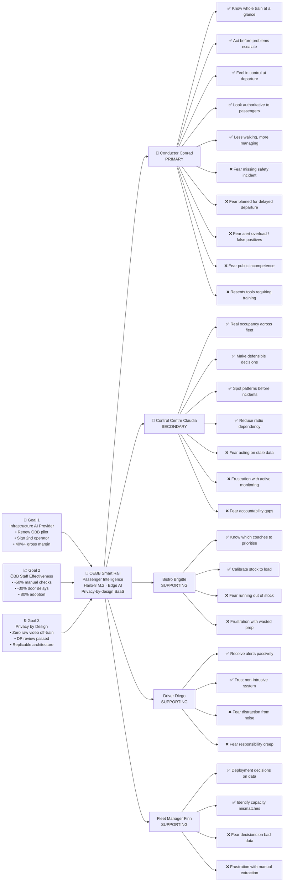

# Trigger Map — OEBB Smart Rail Passenger Intelligence

**Phase:** 2 — Trigger Map
**Date:** 2026-05-14
**Status:** Complete

---

## Overview

| Document | Contents |
|---|---|
| `01-Business-Goals.md` | 3 goals × 3 SMART objectives |
| `02-Conductor-Conrad.md` | Primary persona — full profile + driving forces |
| `03-Control-Centre-Claudia.md` | Secondary persona — full profile + driving forces |
| `04-Supporting-Personas.md` | Brigitte (Bistro), Diego (Driver), Finn (Fleet Manager) |
| `05-Key-Insights.md` | 4 strategic insights + prioritisation table |

---

## Visual Trigger Map

---

## Strategic Focus Statement

**Priority 1 Goal:** Prove ÖBB staff effectiveness (Goal 2) — this is what triggers renewal and expansion

**Priority 1 User:** Conductor Conrad — his adoption is the pilot's single most important metric

**Priority 1 Driving Forces:**
1. Know the whole train at a glance (15/15 — HIGH)
2. Fear missing a safety-critical incident (15/15 — HIGH)
3. Fear alert overload / false positives (15/15 — HIGH)

**Design north star:** Build Conrad's trust in the first journey by showing him something true, useful, and noise-free. Everything else follows from that.
